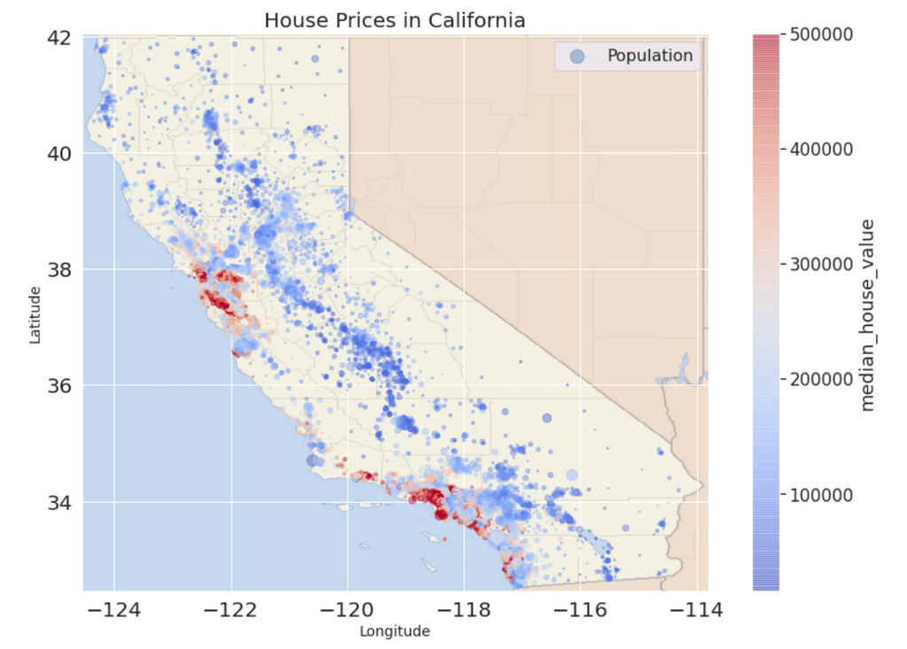
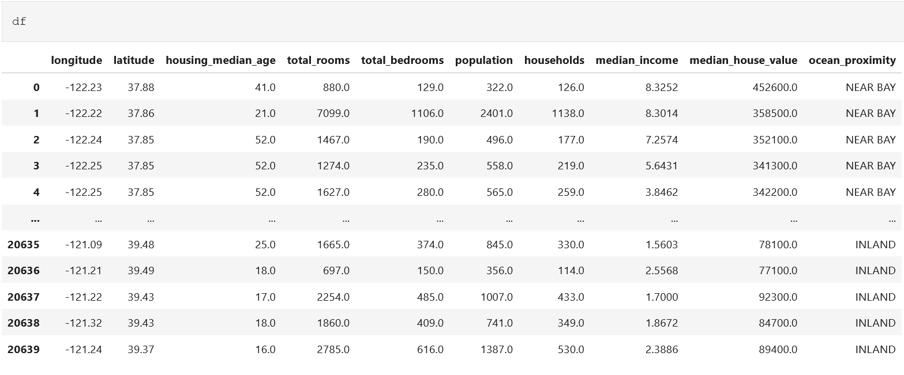
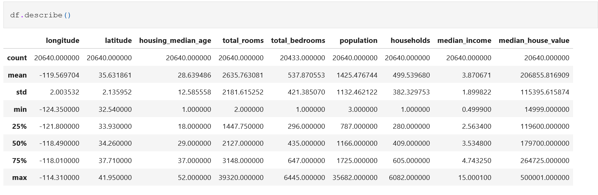
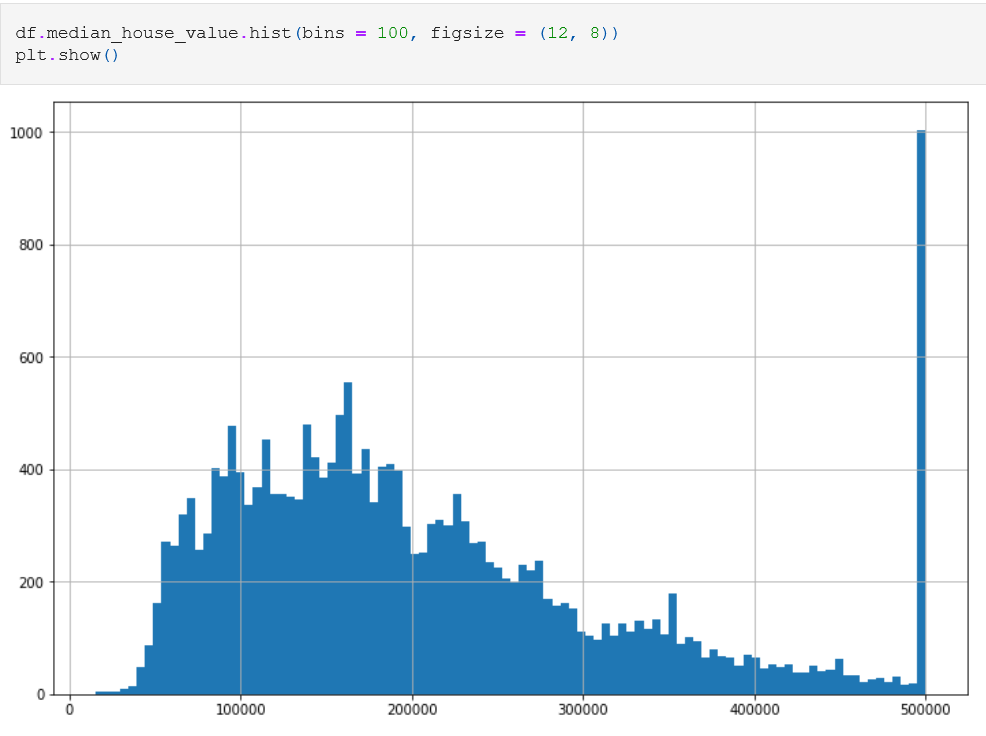

# Housing-Price-Prediction
This project delves into housing data by performing extensive preprocessing, exploratory data analysis (EDA), and feature engineering to classify data into meaningful categories. Utilizing machine learning algorithms, it predicts housing prices, offering a data-driven approach to understanding market dynamics.
  

__Features__:
* **longitude:**  geographic coordinate (district´s east-west position)
* **latitude:**  geographic coordinate (district´s north-south position)
* **housing_median_age:** median age of houses in district
* **total_rooms** Sum of all rooms in district
* **total_bedrooms** Sum of all bedrooms in district
* **population:** total population in district
* **households:** total households in district
* **median_income:** median household income in district 
* **median_house_value:** median house value in district
* **ocean_proximity:** District´s proximity to the ocean

#### Steps followed
**1.** Data Import & first inspection
  

**2.** Data Cleaning  
Oftentimes the data we load has various faults, such as typo, missing values, incomplete data, etc.  
By cleaning up, the data will have better quality to be used for further analysis.
It involves finding null values, outliers and removing unnecessary fields.

**3.** Creating additional features

**4.** Factors influencing House Prices

**5.** Exploratory Data Analysis
  

**6.** Feature Engineering

**7.** Splitting the data into Training & Test Set

**8.** Training the ML model (Random Forest Regressor)

**9.** Evaluating the model on the Test Set

**10.** Feature Importance  

